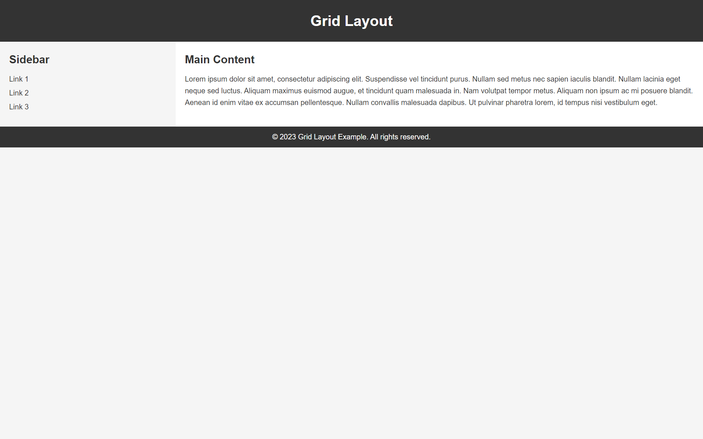

# Exp-4 Create a Web-Layout using GridBOX

## AIM:
To write html & css code to create Web-Layout using GridBOX.
## PROCEDURE:
STEP 1:
Create a html code for the Web-Layout.

STEP 2:
Make style for the Web Layout using style tag.

STEP 3:
Include Style in the html using class and id Selector.

STEP 4:
Verify the output by running the Web-Layout in any web browser.

## PROGRAM:
### HTML:
```html
<!DOCTYPE html>
<html>
<head>
  <title>Grid Layout Example</title>
  <link rel="stylesheet" href="styles.css">
</head>
<body>
  <header>
    <h1>Grid Layout</h1>
  </header>

  <main class="grid-container">
    <aside>
      <h2>Sidebar</h2>
      <ul>
        <li><a href="#">Link 1</a></li>
        <li><a href="#">Link 2</a></li>
        <li><a href="#">Link 3</a></li>
      </ul>
    </aside>
    <section>
      <h2>Main Content</h2>
      <p>Lorem ipsum dolor sit amet, consectetur adipiscing elit. Suspendisse vel tincidunt purus. Nullam sed metus nec sapien iaculis blandit. Nullam lacinia eget neque sed luctus. Aliquam maximus euismod augue, et tincidunt quam malesuada in. Nam volutpat tempor metus. Aliquam non ipsum ac mi posuere blandit. Aenean id enim vitae ex accumsan pellentesque. Nullam convallis malesuada dapibus. Ut pulvinar pharetra lorem, id tempus nisi vestibulum eget.</p>
    </section>
  </main>

  <footer>
    <p>&copy; 2023 Grid Layout Example. All rights reserved.</p>
  </footer>
</body>
</html>
```
### CSS:
```css
/* styles.css */

/* Reset default margins and paddings */
body, h1, h2, ul, li, p {
  margin: 0;
  padding: 0;
}

/* Set body background color and font styles */
body {
  background-color: #f5f5f5;
  font-family: Arial, sans-serif;
  font-size: 16px;
  line-height: 1.6;
  color: #333;
}

/* Style header section */
header {
  background-color: #333;
  padding: 20px;
  color: #fff;
  text-align: center;
}

/* Style main section */
main {
  display: grid;
  grid-template-columns: 25% 75%;
}

/* Style sidebar */
aside {
  background-color: #f5f5f5;
  padding: 20px;
}

aside h2 {
  margin-bottom: 10px;
}

aside ul {
  list-style-type: none;
  margin-bottom: 10px;
}

aside li {
  margin-bottom: 5px;
}

aside a {
  color: #333;
  text-decoration: none;
}

/* Style main content section */
section {
  background-color: #fff;
  padding: 20px;
}

section h2 {
  margin-bottom: 10px;
}

section p {
  margin-bottom: 10px;
}

/* Style footer section */
footer {
  background-color: #333;
  padding: 10px;
  color: #fff;
  text-align: center;
}
```
  ## OUTPUT:
  

  ## RESULT:
  Thus the html & css code to create Web-Layout using GridBOX has been created and output has been verified.

